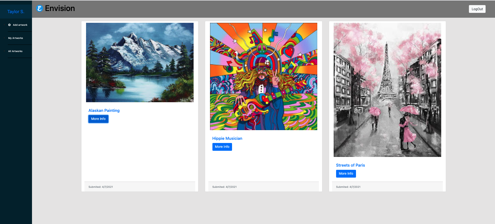
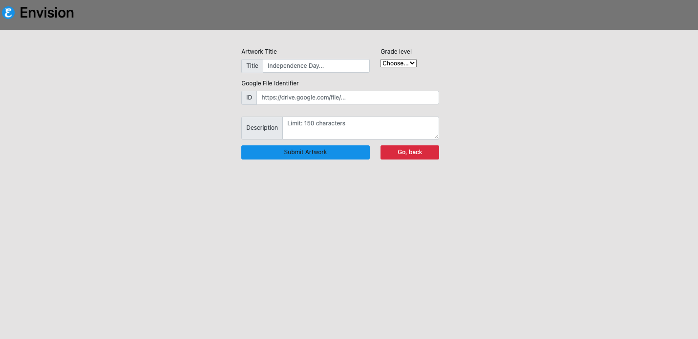

# Envision

  
<h2 style="display: inline-block">Table of Contents</h2>

  <ul>
     <li>
      <a href="https://wow-envision.herokuapp.com/">Heroku Deployment</a>
      </li>
      <li>
      <a href="https://github.com/charvey0/Envision">GitHub Repo</a>
    <li>
      <a href="#project-description">Project Description</a>
        <li>
        <a href="#technologies-used">Technologies Used</a></li>
    </li>
    <li>
      <a href="#getting-started">Getting Started</a>
      </li>
        <li>
        <a href="#installation">Installation</a>
        </li>
    </li>
    <li><a href="#usage">Usage</a>
    </li>
    <li>
    <a href="#tests">Tests</a>
    </li>
    <li><a href="#license">License</a>
    </li>
    <li><a href="#contributions">Contributions</a>
    </li>
    <li><a href="#questions">Questions</a>
    </li>
  </ul>

 

## Project Description

Here at Envision, we built a site where teachers and students can ideate their creativity. This platform helps you and your peers come together to create amazing masterpieces and provide positive feedback on other pieces of art in your school community.

 
 

 
 

## Walkthrough video of live deployment:

## Technologies used:

This app is a mysql database and CMS-style Blog built using Model View Controller (MVC) paradigm.

<ul>
<li> Sequelize</li>
<li>Express</li>
<li>MySQL2</li>
<li>JavaScript</li>
<li>Node.js</li>
<li>Insomnia</li>
<li>Bootstrap</li>
<li>Handlebars</li>
<li>GitHub</li>
<li>Dotenv</li>
</ul>

## Installation
<ol>
<li>Clone this repo</li>
<li>Type **npm install** in the command line.</li>
<li>Connect to the database and create a table named **envision_db**.</li>
<li>Seed the database by entering **node seeds** in the console.</li>
<li>Type **node server** in the console to start the server.</li>
</ol>

## Usage

This app allows the students and teachers to post, view and comment on their artwork. All information can be CREATED, UPDATED, READ and DELETED from the database using api endpoints.

## Tests

I don't have any tests yet. I am working on it.

## License

MIT

## Contributions

Thank you for your interest in contributing. You can fork this project and adapt it to fit your needs.

## Questions

If you have any questions, please contact the project owners by clicking on the GitHub links listed below.

#### [charvey0](https://github.com/charvey0)

#### [justpeachy8688](https://github.com/justpeachy8688)

#### [walkerj90](https://github.com/walkerj90)

#### [codreanvictor](https://github.com/codreanvictor)

#### [cristinaacosta](https://github.com/cristinaacosta)

=======
